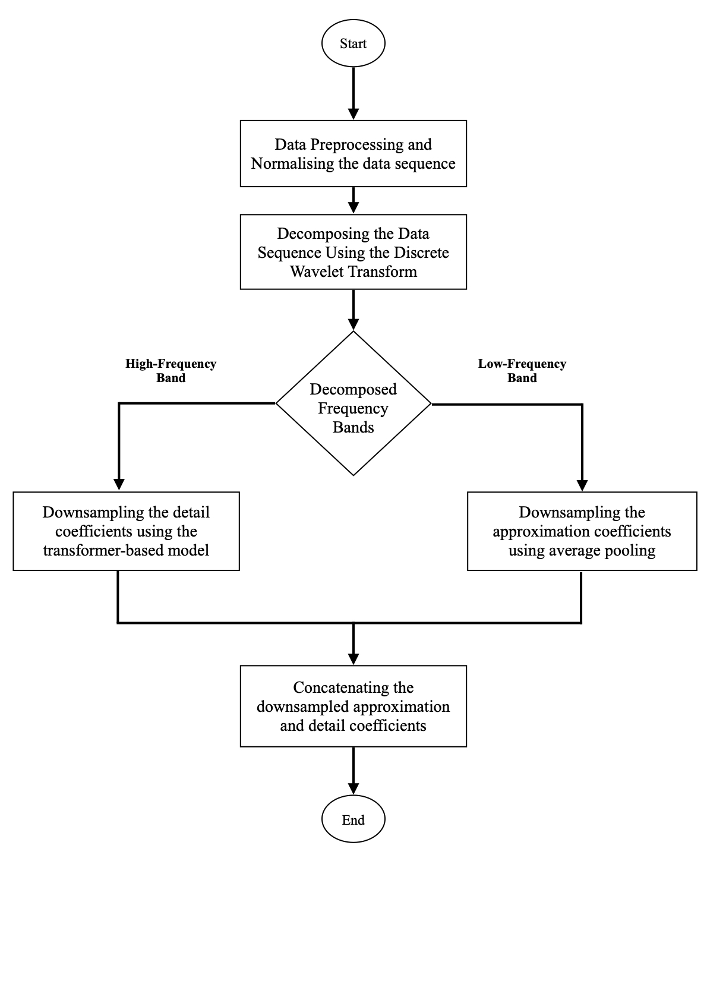
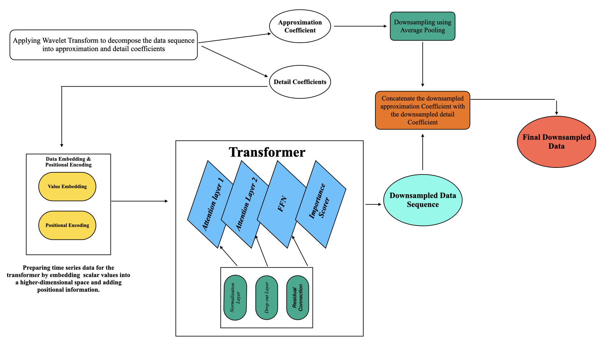

# Wavelet-Transformer Downsampling Algorithm

## Overview

The Wavelet-Transformer Downsampling Algorithm is a sophisticated method for downsampling time series data while preserving critical temporal and spectral characteristics. It combines wavelet decomposition with a transformer-based architecture to selectively retain the most informative points in a time series, making it suitable for applications requiring efficient data compression, such as signal processing, financial time series analysis, and IoT data reduction.



The algorithm leverages:

- **Wavelet Decomposition**: To separate the signal into approximation (low-frequency) and detail (high-frequency) coefficients using Discrete Wavelet Transform (DWT).
- **Transformer Architecture**: To process detail coefficients with global and local attention mechanisms, selecting key points based on importance scores.
- **Custom Loss Function**: A combination of Mean Squared Error (MSE) and frequency-domain loss to ensure fidelity in both time and frequency domains.

This implementation is built using TensorFlow, Keras, NumPy, and PyWavelets, and is designed to handle batched time series data with flexible configurations.



## Key Components

### 1. `get_wavedec_coeff_lengths`

- **Purpose**: Computes the lengths of approximation (cA) and detail (cD) coefficients for a given signal length, wavelet type, decomposition level, and mode.
- **Key Features**:
  - Uses a dummy signal for efficiency, avoiding computation on real data.
  - Supports various wavelet types (e.g., `db4`, `haar`) and decomposition modes (e.g., `symmetric`).
  - Validates input parameters, ensuring non-negative decomposition levels.
- **Usage**: Determines coefficient sizes for wavelet decomposition, critical for configuring the model.

### 2. `TimeSeriesEmbedding`

- **Purpose**: Embeds time series data into a higher-dimensional space with learnable weights and adds sinusoidal positional encodings.
- **Key Features**:
  - Maps input time series (shape: `[batch_size, maxlen, 1]`) to an embedded space (shape: `[batch_size, maxlen, embed_dim]`).
  - Incorporates positional encodings to capture temporal relationships.
  - Validates input shapes to ensure compatibility.
- **Usage**: Prepares input data for the transformer block by adding positional context.

### 3. `DownsampleTransformerBlock`

- **Purpose**: Processes embedded time series data through a transformer block, combining global and local attention, and downsamples the sequence based on attention scores.
- **Key Features**:
  - Uses multi-head attention for global and local feature extraction.
  - Combines attention scores with weighted averages (`global_weight`, `local_weight`) to compute importance scores.
  - Downsamples the sequence to a fraction defined by `retention_rate` (e.g., 0.8 retains 80% of the sequence).
  - Includes feed-forward networks (FFN), layer normalization, dropout, and residual connections for robust processing.
- **Usage**: Selects the most important points in the embedded sequence, reducing dimensionality while preserving key features.

### 4. `WaveletDownsamplingModel`

- **Purpose**: Integrates wavelet decomposition and the transformer-based downsampling into a unified model.
- **Key Features**:
  - Performs DWT to split input signals into approximation and detail coefficients.
  - Processes detail coefficients through the `DownsampleTransformerBlock`.
  - Optionally downsamples approximation coefficients using average pooling (`approx_ds_factor`).
  - Normalizes detail coefficients if specified (`normalize_details`).
  - Returns a downsampled signal and optional indices for selected points.
- **Usage**: The main model for downsampling time series data, combining wavelet and transformer strengths.

### 5. `downsampling_loss`

- **Purpose**: A custom loss function that combines Mean Squared Error (MSE) and frequency-domain loss.
- **Key Features**:
  - MSE ensures time-domain fidelity between original and downsampled signals.
  - Frequency-domain loss (based on FFT) preserves spectral characteristics.
  - Weighted combination (MSE + 0.5 \* frequency loss) balances time and frequency objectives.
- **Usage**: Used during model training to optimize the downsampling process.

### 6. `build_detail_transformer`

- **Purpose**: Constructs a transformer model for processing detail coefficients.
- **Key Features**:
  - Stacks multiple `DownsampleTransformerBlock` layers (`num_transformer_blocks`).
  - Includes a final convolutional and dense layer to produce the downsampled output.
  - Returns both the downsampled signal and indices of selected points.
- **Usage**: Builds the transformer component of the `WaveletDownsamplingModel`.

## Installation

### Prerequisites

- Python 3.11
- Required packages:
  ```bash
  pip install tensorflow>=2.10 numpy>=1.19 pywt>=1.4 pytest>=7.0 pyyaml psutil pandas matplotlib scikit-learn scipy
  ```

### Setup

1. Clone the repository:
   ```bash
   git clone https://github.com/your-repo/Wavelet-Transformer-Downsampler.git
   cd Wavelet-Transformer-Downsampler
   ```
2. Install dependencies:
   ```bash
   pip install -r requirements.txt
   ```
3. Ensure the M4 dataset files (e.g., `Hourly-new.csv`) are placed in the `data_test/` directory or update the file paths in `main.py` and `evaluation.py`.

## Usage

### Training the Model

Run the training pipeline using the `non-stream` mode:

```bash
python main.py --pipeline non-stream --hourly_train data_test/Hourly-new.csv
```

- Configurable parameters are defined in `model_config.yaml` (e.g., `embed_dim`, `num_heads`, `retention_rate`).
- The trained model is saved as `downsampling_model.keras` and `detail_transformer_model.keras`.

### Evaluating the Model

Evaluate the trained model on a test dataset:

```bash
python evaluation.py --test_file data_test/Quarterly-new.csv
```

- Outputs metrics (MSE, RMSE, MAE, R², correlation, spectral MSE) and visualizations saved as PNG files (e.g., `comparison_sample_*.png`).
- Logs are saved to `evaluation.log`.

### Running Unit Tests

Run unit tests to verify the implementation:

```bash
pytest test_downsampling.py -v
```

- Tests cover input validation, shape correctness, and loss function behavior.
- To suppress TensorFlow INFO logs:
  ```bash
  export TF_CPP_MIN_LOG_LEVEL=2
  pytest test_downsampling.py -v
  ```

## Configuration

The `model_config.yaml` file specifies hyperparameters:

```yaml
embed_dim: 64
num_heads: 4
ff_dim: 64
num_transformer_blocks: 1
retention_rate: 0.8
global_attention_weight: 0.7
local_attention_weight: 0.3
wavelet_name: db4
dwt_level: 1
approx_ds_factor: 2
original_length: 300
normalize_details: true
decomposition_mode: symmetric
batch_size: 32
epochs: 20
learning_rate: 0.0001
```

Adjust these values to tune the model for specific datasets or performance requirements.

## Key Information

- **Input Requirements**:
  - Time series data as a NumPy array with shape `(batch_size, sequence_length, 1)`.
  - Default `sequence_length` is 300 (configurable via `original_length`).
- **Output**:
  - Downsampled time series with reduced length (determined by `retention_rate` and `approx_ds_factor`).
  - Optional indices of selected points for reconstruction.
- **Performance Considerations**:
  - Uses wavelet decomposition for efficient frequency analysis.
  - Transformer-based downsampling reduces sequence length while preserving key features.
  - Memory usage is monitored during training (logged in `main.log`).
- **Evaluation Metrics**:
  - Mean Squared Error (MSE)
  - Root Mean Squared Error (RMSE)
  - Mean Absolute Error (MAE)
  - R² Score
  - Pearson Correlation
  - Spectral MSE (frequency-domain error)
- **Dataset**: Designed for the M4 forecasting dataset but adaptable to other time series datasets.

## Limitations

- The `stream` pipeline mode is not implemented in this version.
- Performance depends on the choice of wavelet (`db4` by default) and transformer hyperparameters.
- Large datasets may require significant memory; adjust `batch_size` or use a smaller `original_length` if needed.

## Contributing

Contributions are welcome! Please:

1. Fork the repository.
2. Create a feature branch (`git checkout -b feature/YourFeature`).
3. Commit changes (`git commit -m "Add YourFeature"`).
4. Push to the branch (`git push origin feature/YourFeature`).
5. Open a pull request.

## License

This project is licensed under the MIT License. See the `LICENSE` file for details.

## Contact

For questions or issues, please open an issue on the GitHub repository or contact the maintainer at [your-email@example.com].
